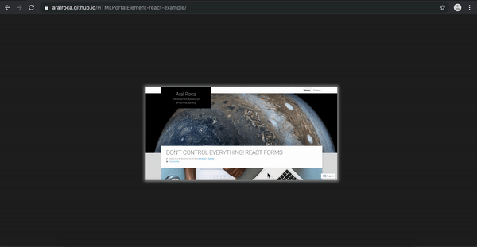
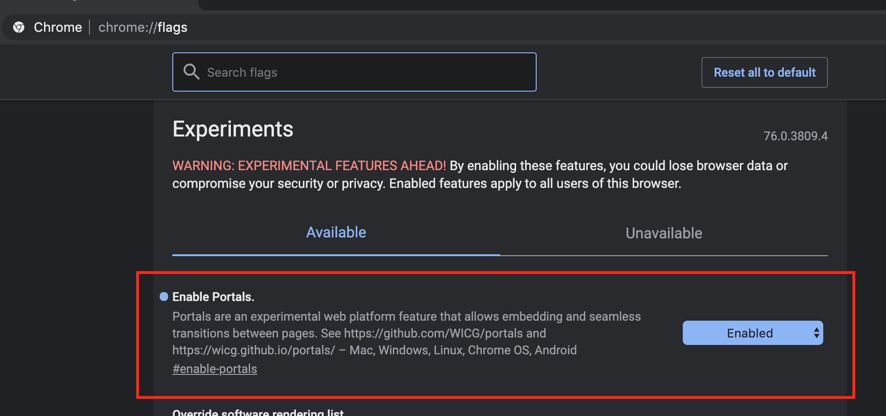

# HTMLPortalElement example in React (POC)

HTMLPortalElement is a draft. Documentation here: 

* https://wicg.github.io/portals/#the-portalactivateevent-interface

## Demo 🎉: 

* https://aralroca.github.io/HTMLPortalElement-react-example/

To see correctly the demo, be sure to have Chrome Canary with this flag actived: 

